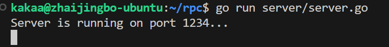
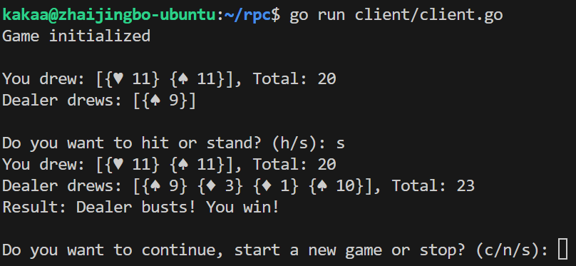

## RPC Blackjack 实验报告

本实验实现了一个基于 RPC（Remote Procedure Call）机制的 Blackjack（21点）游戏，允许客户端与服务器之间进行交互，完成游戏的逻辑和状态管理。

### 分析与实现

需要服务器端和客户端两个程序。为保证可靠性，服务器端尽可能减小向客户端传递的信息，并且不信任任何来自客户端的数据。为了实现这一点，服务器端需要保存一局游戏的所有状态，在每次操作后仅返回一个字符串提示客户端游戏状态和可能的下一步操作等。

客户端需要读取玩家的输入，并调用服务器端的方法。此外，客户端还需要输出显示牌面和游戏结果等功能。

#### 服务器端设计

- 使用 `net/rpc` 包实现 RPC 服务，提供游戏的核心功能。

- 包含 `blackjack` 结构体，管理牌堆、玩家、庄家和游戏状态。

- 提供 `InitGame`、`DealCards`、`EndGame` 等方法供客户端调用。

#### 客户端设计

- 通过 RPC 调用服务器端方法，实现与玩家的互动。

- 提供发牌、显示牌面和结果反馈等功能。

#### 代码架构

`common/common.go` 保存了服务器和客户端均需要使用的方法和结构体

`server/server.go` 包含服务器端的逻辑，庄家行为和需要被客户端远程调用的方法。

`client/client.go` 包含客户端逻辑，包括根据服务器端的反馈提供下一步选择，以及判断游戏终止的逻辑。

### 实际演示

为了运行服务器端，在项目根目录使用：

```shell
go run server/server.go
```

如果一切顺利，能看到：


为了运行客户端，在项目根目录使用：

```shell
go run client/client.go
```

客户端会给出提示，输入对应指令以进行下一步操作：


### 总结

本次实验成功实现了一个基于 RPC 的 Blackjack 游戏；通过 RPC，客户端与服务器能够高效地进行数据交互，游戏逻辑清晰且易于维护。

在实现过程中，我们掌握了以下关键技术要点：

- RPC 服务的定义与调用。
- 结构体的使用与数据封装。
- 游戏状态管理与逻辑实现。

未来的改进方向包括：

- 增加更复杂的游戏规则，如分牌、加倍等。
- 实现更完善的错误处理机制，提高游戏的鲁棒性。
- 提供图形用户界面（GUI），提升用户体验。